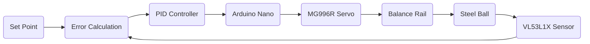

<div align="center">


# ⚖️ PID Controlled 1-D Ball Balance System

### *Real-Time Closed Loop Control using Arduino Nano & Time-of-Flight Sensing*

<p align="center">


</p>

---

### Department of Electronics & Communication Engineering

### Birla Institute of Technology, Mesra

*"Learning Control Systems through Practical Engineering."*

</div>

---

# 📌 Navigation

- [📖 Project Overview](#-project-overview)
- [🎯 Objectives](#-objectives)
- [⚡ Features](#-key-features)
- [🏗 System Architecture](#-system-architecture)
- [🔄 Working Principle](#-working-principle)
- [🛠 Hardware Stack](#-hardware-stack)
- [👨‍💻 Team](#-team)
- [📅 Timeline](#-development-roadmap)
- [✅ Success Criteria](#-success-criteria)
- [📂 Repository Structure](#-repository-structure)

---

# 📖 Project Overview

> **A practical implementation of classical control theory using embedded systems.**

The **PID Controlled Ball Balance System** demonstrates how an unstable mechanical system can be stabilized using a real-time feedback controller.

A steel ball rolls freely on a balancing rail while a **VL53L1X Time-of-Flight sensor** continuously measures its position. The Arduino Nano executes a PID controller that calculates the required corrective action and commands a **MG996R servo motor** to tilt the rail.

The entire system forms a **closed feedback loop** capable of maintaining stability even under external disturbances.

---

# 🎯 Objectives

| 🎓 Learning | ⚙️ Engineering | 📈 Performance |
|:------------|:---------------|:---------------|
| Learn PID Theory | Build Embedded System | Minimize Overshoot |
| Feedback Control | Mechanical Design | Reduce Error |
| Sensor Integration | Electronics Assembly | Improve Stability |
| Real-Time Programming | Hardware Integration | Faster Response |

---

# ⚡ Key Features

- 🎯 Closed Loop Feedback Control
- ⚙️ PID Controller
- 📡 Time-of-Flight Position Measurement
- 🔄 Real-Time Servo Control
- 📈 Live Position Correction
- 🪵 Custom CAD Designed Structure
- 📊 PID Gain Tuning
- 🔋 Independent Servo Power Supply
- 🧠 Embedded Programming
- 📑 Modular Documentation

---

# 🏗 System Architecture



---

# 🔄 Working Principle

```text
Ball Position
      │
      ▼
VL53L1X Sensor
      │
      ▼
Arduino Nano
      │
      ▼
PID Algorithm
      │
      ▼
Servo Motor
      │
      ▼
Rail Tilting
      │
      ▼
Ball Motion
      │
      └───────────────Feedback───────────────┘
```

The controller continuously performs the following operations:

1. Measure Ball Position
2. Compute Position Error
3. Execute PID Algorithm
4. Generate PWM Signal
5. Rotate Servo
6. Tilt Rail
7. Correct Ball Motion
8. Repeat Every Control Cycle

---

# 🛠 Hardware Stack

| Component | Model | Purpose |
|------------|--------|----------|
| 🟦 Microcontroller | Arduino Nano | Main Controller |
| 🔵 Servo | MG996R | Rail Actuation |
| 📡 Distance Sensor | VL53L1X | Ball Position Measurement |
| 🔋 DC Converter | XL4015 | Stable Power Supply |
| 🪵 Structure | Wooden Rail | Mechanical Platform |
| ⚪ Controlled Object | Steel Ball | Plant |

---

# 📊 Control Equation

The controller computes

$$
u(t)=K_p e(t)+K_i\int e(t)\,dt+K_d\frac{de(t)}{dt}
$$

where

- **Kp** → Proportional Gain
- **Ki** → Integral Gain
- **Kd** → Derivative Gain

---

# 📂 Project Modules

| Module | Description |
|---------|-------------|
| 📖 Documentation | Complete Design Documentation |
| 💻 Source Code | Arduino PID Implementation |
| 🛠 CAD | Mechanical Design Files |
| 📷 Images | Project Images |
| 📊 Testing | Experimental Results |
| 🎥 Videos | Demonstration Videos |

---

# 👨‍💻 Team

| Member | Responsibility |
|----------|----------------|
| **Aayush Raj** | PID Algorithm • Embedded Programming • Documentation |
| **Nityam Jayaswal** | Procurement • Assembly • PID Implementation |
| **Roushan Kumar Sinha** | CAD Design • Mechanical Fabrication |
| **Vinayak Gupta** | Testing • Validation • Documentation |

---

# 📅 Development Roadmap

```text
Research
   │
   ▼
Concept
   │
   ▼
CAD Design
   │
   ▼
Procurement
   │
   ▼
Fabrication
   │
   ▼
Electronics
   │
   ▼
Programming
   │
   ▼
PID Tuning
   │
   ▼
Testing
   │
   ▼
Documentation
```

---

# ✅ Success Criteria

- ✅ Stable Closed Loop Operation
- ✅ Minimal Steady-State Error
- ✅ Low Overshoot
- ✅ Fast Settling Time
- ✅ Reliable Sensor Feedback
- ✅ Smooth Servo Motion
- ✅ Robust Against Disturbances

---

# 📂 Repository Structure

```text
📦 PID-1D-Ball-Balance
│
├── 📂 CAD
├── 📂 Code
├── 📂 Images
├── 📂 Testing
├── 📂 Videos
│
└── 📂 docs
    ├── 📄 00_Overview.md
    ├── 📄 01_Learning_Resources.md
    ├── 📄 02_Design.md
    ├── 📄 03_Build_Logs.md
    ├── 📄 04_Testing.md
    ├── 📄 05_Budget_Procurement.md
    ├── 📄 06_Safety.md
    ├── 📄 07_Lessons_Learnt.md
    └── 📄 08_Future_Work.md
```

---

# 🚀 Future Enhancements

- 📹 Vision-Based Ball Tracking
- 🤖 Adaptive PID Controller
- 🧠 AI-Based Gain Optimization
- 🎯 Ball-on-Plate System
- 📡 Wireless Monitoring Dashboard
- 🛰 UAV Attitude Control Implementation
- 🌐 ROS Integration
- 📈 MATLAB/Simulink Digital Twin

---

<div align="center">

## ⭐ *"Every autonomous aircraft, robot, and spacecraft begins with mastering the fundamentals of feedback control."*

---


### Built with ❤️ by Team 4

**Birla Institute of Technology, Mesra**

</div>
