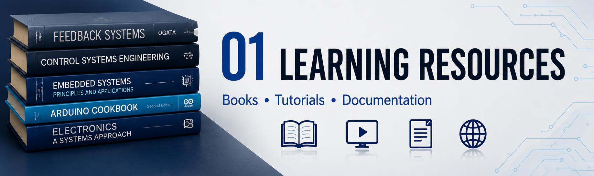

<div align="center">

# 📚 Learning Resources

### *Research Papers • Books • Simulators • Courses • Documentation*



---

*"Great engineering begins by standing on the shoulders of those who came before us."*

</div>

---

# 📖 Table of Contents

- Overview
- Why Study PID?
- Fundamental Concepts
- Recommended Books
- Research Papers
- Online Courses
- Video Lectures
- Interactive Simulators
- Documentation
- Software Tools
- Mathematics References
- Useful GitHub Repositories
- Learning Roadmap

---

# 📖 Overview

Before building the hardware, a comprehensive literature survey was conducted to understand the theoretical foundations of classical feedback control.

The project requires knowledge from multiple engineering disciplines including

- Control Systems
- Embedded Systems
- Sensors
- Electronics
- Mechanical Design
- Programming
- Mathematics

The objective of this section is to document every major resource that contributed to the design of this project.

---

# 🎯 Why Learn PID?

PID controllers are among the most widely used control algorithms ever developed.

More than **95% of industrial control loops** still employ some variation of PID because of their simplicity, reliability, and effectiveness.

Applications include

- ✈ Aircraft Stability
- 🚁 Drone Flight Controllers
- 🤖 Robotics
- 🚗 Autonomous Vehicles
- 🏭 Industrial Automation
- 🛰 Satellite Attitude Control
- ⚡ Power Electronics
- 🛠 CNC Machines

---

# 📘 Fundamental Concepts

The following concepts should be understood before attempting this project.

| Topic | Importance |
|---------|------------|
| Feedback Control | ⭐⭐⭐⭐⭐ |
| Closed Loop Systems | ⭐⭐⭐⭐⭐ |
| Transfer Functions | ⭐⭐⭐⭐ |
| Stability | ⭐⭐⭐⭐⭐ |
| Laplace Transform | ⭐⭐⭐⭐ |
| Differential Equations | ⭐⭐⭐ |
| Frequency Response | ⭐⭐⭐⭐ |
| Bode Plot | ⭐⭐⭐⭐⭐ |
| Root Locus | ⭐⭐⭐⭐ |
| State Space | ⭐⭐ |

---

# 📚 Recommended Books

---

## 1. Modern Control Engineering

**Author:** Katsuhiko Ogata

⭐⭐⭐⭐⭐

Topics Covered

- Transfer Functions
- Root Locus
- PID Design
- State Space
- Frequency Response

Recommended Chapters

- Chapter 2
- Chapter 4
- Chapter 8
- Chapter 10

---

## 2. Automatic Control Systems

**Author**

Benjamin Kuo

Excellent for

- Classical Control
- Stability
- PID
- Mathematical Modeling

---

## 3. Feedback Control of Dynamic Systems

Franklin, Powell & Emami

One of the best books for beginners.

---

## 4. PID Controllers

Karl Åström

This book focuses entirely on PID controllers.

Topics

- Tuning
- Industrial PID
- Anti Windup
- Digital PID

---

# 📄 Research Papers

Recommended reading

---

### PID Control of Ball and Beam Systems

Focus

- Controller tuning
- Experimental setup
- Sensor selection

---

### Digital PID Controller Design

Topics

- Sampling
- Discrete PID
- Embedded implementation

---

### Ball Balancing Using Embedded Systems

Topics

- Arduino implementation
- Servo dynamics
- Sensor latency

---

# 🎓 Online Courses

## MIT OpenCourseWare

Course

Feedback Control Systems

Topics

- Dynamic Systems
- Frequency Response
- Stability

⭐⭐⭐⭐⭐

---

## NPTEL

Control Engineering

Instructor

IIT Professors

Excellent for Indian engineering curriculum.

---

## Coursera

Modern Robotics

Useful for understanding

- Feedback
- Motion
- Control

---

# 🎥 Video Lectures

---

## Brian Douglas

Probably the best PID explanation on YouTube.

Topics

- PID
- Bode Plot
- Root Locus

⭐⭐⭐⭐⭐

---

## Steve Brunton

Excellent mathematical explanations.

---

## MATLAB

Official Control Tutorials

---

# 🖥 Interactive Simulators

---

## PID Simulator

Allows real-time adjustment of

- Kp
- Ki
- Kd

Observe

- Rise Time
- Settling Time
- Overshoot
- Oscillation

Recommended before writing code.

---

## MATLAB Simulink

Professional simulation platform.

---

## Scilab Xcos

Free alternative.

---

# 🛠 Software Used

| Software | Purpose |
|-----------|----------|
| Arduino IDE | Programming |
| Fusion 360 | CAD Design |
| Git | Version Control |
| GitHub | Repository |
| VS Code | Code Editing |
| MATLAB (Optional) | Simulation |

---

# 📐 Mathematics References

The project requires understanding of

- Differential Equations
- Integration
- Derivatives
- Laplace Transform
- Transfer Functions
- Error Analysis
- Stability Theory

Important equations

## Error

$$

e(t)=r(t)-y(t)

$$

---

## PID Equation

$$

u(t)=K_p e(t)+K_i\int e(t)dt+K_d\frac{de(t)}{dt}

$$

---

# 💻 Useful GitHub Repositories

Study repositories related to

- Arduino PID
- Ball Balancer
- Self Balancing Robot
- Control Systems
- Embedded Systems

Things to observe

- Folder Structure
- Documentation
- Code Style
- Testing

---

# 🧠 Learning Roadmap

```text
Control Theory
        │
        ▼
Feedback Systems
        │
        ▼
PID Controller
        │
        ▼
Arduino Programming
        │
        ▼
Servo Control
        │
        ▼
Sensor Integration
        │
        ▼
Hardware Assembly
        │
        ▼
PID Tuning
        │
        ▼
Testing
        │
        ▼
Optimization
```

---

# 📌 Key Takeaways

> [!NOTE]
>
> Understanding **why** a PID controller works is far more important than memorizing the equations.

> [!TIP]
>
> Always begin tuning with **Kp**, then **Kd**, and finally **Ki**.

> [!IMPORTANT]
>
> Never tune all three gains simultaneously. This usually leads to unstable behaviour and makes debugging significantly harder.

---

# 📚 References

| Type | Resource |
|-------|----------|
| 📘 Book | Modern Control Engineering — Ogata |
| 📘 Book | Automatic Control Systems — Kuo |
| 📘 Book | PID Controllers — Åström |
| 🎓 Course | MIT OpenCourseWare |
| 🎓 Course | NPTEL Control Engineering |
| 🎥 Videos | Brian Douglas Control Systems |
| 🖥 Simulator | PID Simulator |
| 💻 Software | Arduino IDE |
| 💻 CAD | Fusion 360 |

---

<div align="center">

## ⭐ "The controller is only as good as the engineer who understands it."

---

**Next Documentation:** `02_Design.md`

</div>
