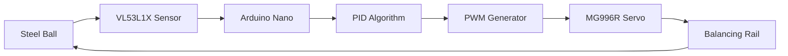
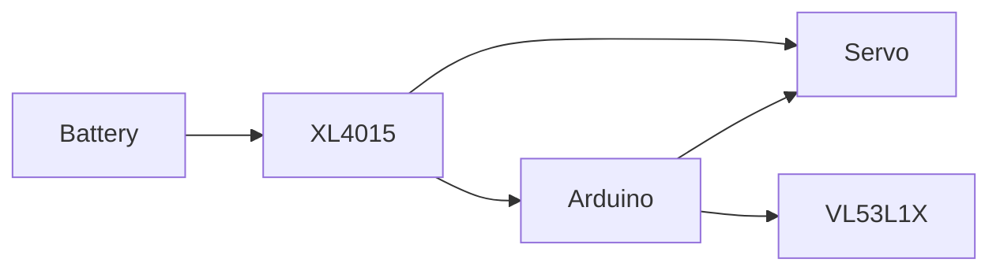
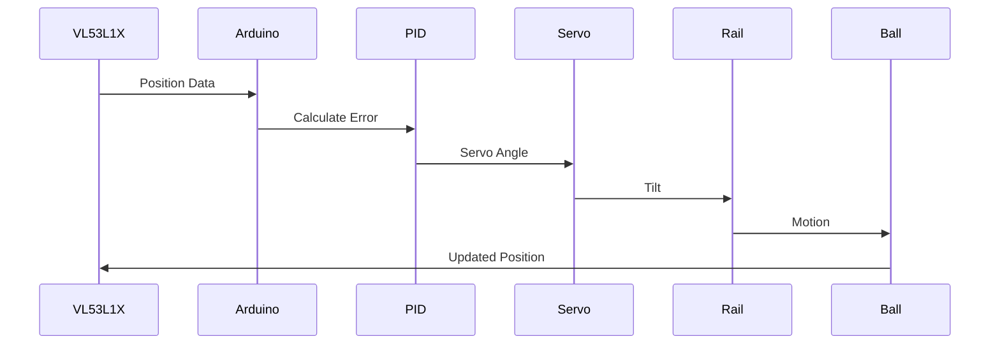

<div align="center">

# 🏗️ System Design

### *Mechanical • Electrical • Control System • Software Architecture*


---


---

*"Every stable control system begins with a well-designed mechanical and electrical architecture."*

</div>

---

# 📑 Table of Contents

- Design Philosophy
- System Requirements
- Overall Architecture
- Mechanical Design
- CAD Model
- Electrical Design
- Power Distribution
- Control Architecture
- Software Architecture
- Data Flow
- Design Trade-offs
- Component Selection
- Engineering Constraints
- Final Design Summary

---

# 🎯 Design Philosophy

The primary objective of the design was to create a compact, low-cost, and educational platform capable of demonstrating the principles of classical closed-loop feedback control.

The design emphasizes:

- Simplicity
- Reliability
- Ease of fabrication
- Low component cost
- Modular construction
- Easy debugging
- Expandability

Instead of maximizing performance, the focus was on creating a system that clearly demonstrates PID behavior while remaining suitable for classroom demonstrations and future upgrades.

---

# 📌 Design Requirements

| Requirement | Target |
|-------------|--------|
| Control Type | Closed Loop |
| Degrees of Freedom | 1 |
| Controller | PID |
| Sensor | VL53L1X |
| Actuator | MG996R Servo |
| Processor | Arduino Nano |
| Rail Length | 600 mm |
| Supply Voltage | 5V |
| Real-Time Operation | Yes |

---

# 🏗 Overall System Architecture



---

# ⚙ Mechanical Design

## Objective

The mechanical system serves as the physical plant of the control system.

Its primary purpose is to convert servo rotation into rail inclination, thereby controlling the movement of the steel ball.

---

## Major Components

| Component | Purpose |
|------------|----------|
| Rail | Ball movement |
| Servo Mount | Actuator support |
| Pivot Shaft | Rotation axis |
| Connecting Link | Motion transmission |
| Base Plate | Structural support |
| End Stops | Prevent ball from falling |

---

## Design Considerations

During the design phase, several factors were considered.

### Rail Length

A longer rail

✅ Better position resolution

❌ Higher servo torque

A shorter rail

✅ Faster response

❌ Less measurement accuracy

Final Selection

> **600 mm**

---

### Material Selection

| Material | Advantages | Disadvantages |
|-----------|------------|---------------|
| Wood ✅ | Cheap, Easy to Machine | Moisture Sensitive |
| Aluminium | Strong | Expensive |
| Acrylic | Lightweight | Brittle |
| Steel | Very Strong | Heavy |

Wood was selected because it offered the best balance between cost, machinability, and structural rigidity.

---

# 🖼 CAD Model

<div align="center">

## Front View


---

## Isometric View


---

## Side View


</div>

---

# 📐 Mechanical Dimensions

| Parameter | Value |
|------------|-------|
| Rail Length | 600 mm |
| Overall Height | 250 mm |
| Degrees of Freedom | 1 |
| Servo Type | MG996R |
| Pivot Position | Center |

---

# ⚡ Electrical Design

## Components

| Device | Function |
|----------|----------|
| Arduino Nano | Main Controller |
| VL53L1X | Distance Measurement |
| MG996R | Actuator |
| XL4015 | Voltage Regulation |
| Capacitor | Noise Filtering |

---

# 🔌 Electrical Block Diagram



---

# ⚡ Power Distribution

```text
12V Supply
      │
      ▼
XL4015 Buck Converter
      │
      ├────────► Arduino Nano
      │
      ├────────► VL53L1X
      │
      └────────► MG996R Servo
```

---

# 🧠 Control Architecture

The project implements a classical PID controller.

```text
Reference Position

↓

Error

↓

PID Controller

↓

Servo Angle

↓

Rail Angle

↓

Ball Position

↓

Sensor Feedback

↓

Error
```

---

# 📈 PID Equation

The control signal is

$$

u(t)=K_p e(t)+K_i\int e(t)\,dt+K_d\frac{de(t)}{dt}

$$

where

- **Kp** controls responsiveness.
- **Ki** removes steady-state error.
- **Kd** minimizes overshoot.

---

# 🔄 Data Flow



---

# 💻 Software Architecture

```text
Setup()

↓

Initialize Servo

↓

Initialize Sensor

↓

Loop()

↓

Read Sensor

↓

Compute Error

↓

PID Calculation

↓

Generate PWM

↓

Move Servo

↓

Repeat
```

---

# ⚖ Design Trade-offs

## Servo Selection

| Servo | MG996R | DS3225 |
|---------|---------|---------|
| Torque | ⭐⭐⭐⭐ | ⭐⭐⭐⭐⭐ |
| Price | ⭐⭐⭐⭐⭐ | ⭐⭐⭐ |
| Precision | ⭐⭐⭐ | ⭐⭐⭐⭐⭐ |

Chosen:

✅ MG996R

Reason

Lower cost with sufficient torque.

---

## Sensor Selection

| Sensor | VL53L1X | HC-SR04 |
|----------|----------|-----------|
| Accuracy | ⭐⭐⭐⭐⭐ | ⭐⭐⭐ |
| Latency | ⭐⭐⭐⭐⭐ | ⭐⭐ |
| Noise | Low | Medium |
| Field of View | Narrow | Wide |

Chosen

✅ VL53L1X

---

## Controller Selection

| Controller | Arduino Nano | ESP32 |
|--------------|--------------|---------|
| Ease of Programming | ⭐⭐⭐⭐⭐ | ⭐⭐⭐⭐ |
| Processing Power | ⭐⭐⭐ | ⭐⭐⭐⭐⭐ |
| Cost | ⭐⭐⭐⭐⭐ | ⭐⭐⭐⭐ |

Chosen

✅ Arduino Nano

---

# 🚧 Engineering Constraints

The following constraints influenced the design:

- Limited project budget
- Servo torque limitations
- Sensor update rate
- Mechanical backlash
- Rail friction
- Fabrication accuracy
- Arduino memory limitations
- Real-time execution

---

# ✅ Final Design Summary

| Feature | Status |
|-----------|--------|
| Mechanical Design | ✅ Complete |
| CAD Model | ✅ Complete |
| Electrical Design | ✅ Complete |
| Software Architecture | ✅ Complete |
| PID Integration | ✅ Complete |

---

> [!NOTE]
>
> The mechanical design prioritizes simplicity and reliability over maximum performance.

> [!TIP]
>
> Keeping the pivot exactly at the rail center significantly improves control symmetry.

> [!IMPORTANT]
>
> Servo backlash is one of the largest contributors to steady-state positioning error. Mechanical rigidity should always be prioritized during fabrication.

---

<div align="center">

## 🎯 Design Complete

*"Good control starts with good engineering."*

---

➡ **Next:** `03_Build_Logs.md`

</div>